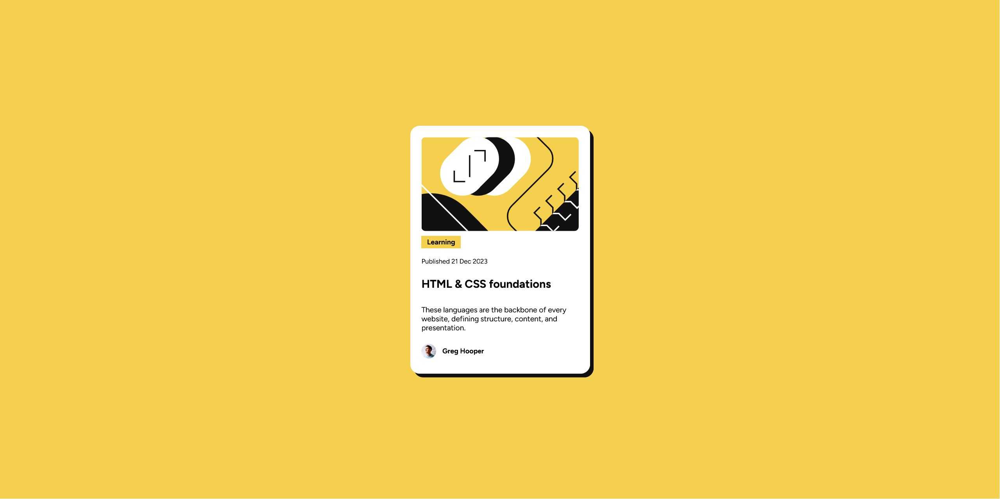

# Frontend Mentor - QR code component solution

This is a solution to the [Blog preview card challenge on Frontend Mentor](https://www.frontendmentor.io/challenges/blog-preview-card-ckPaj01IcS). Frontend Mentor challenges help you improve your coding skills by building realistic projects. 

## Table of contents

- [Overview](#overview)
  - [Intro](#Intro)
  - [Screenshot](#screenshot)
  - [Links](#links)
- [My process](#my-process)
  - [Built with](#built-with)
- [Author](#author)

## Overview

## Intro

Simple responsive page with a blog preview card, part of the [Learning Paths](https://www.frontendmentor.io/learning-paths) from FrontEnd Mentor.
This is my second project which I used to practice Angular on my journey of learning this language, this is my first time
creating multiple components and interfaces and trying to divide a project into smaller pieces to work with angular 

### Screenshot

### Links

- Solution URL: [netlify](https://agl-blog-card-preview.netlify.app/)

## My process

As this has been my first time actually working on my own to divide a project into smaller components with angular I decided
to start from the bottom and start doing the author card as a component, as they are 2 different components inside, then
the rest of the content as a single component and later I wrapped it into another blog-card-component which while not necessary
for this particular small project I felt would be a good idea in-case I had to keep working on it and add functions or events.

### Built with

- Semantic HTML5 markup
- CSS custom properties
- [Angular](https://angular.dev/) - JS library

## Author

- Linkedin - [Arturo Guzmán Lucena](https://www.linkedin.com/in/agl-ab5aa228a/)
- Frontend Mentor - [@MrBlueA](https://www.frontendmentor.io/profile/MrBlueA)